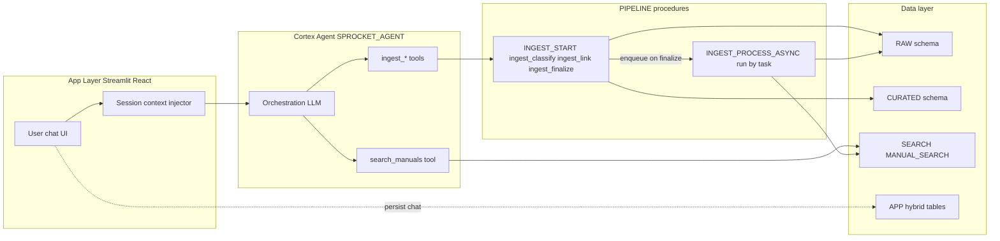

# Architecture

## Database layout

```
SPROCKET (database)
  |- RAW         -- Pipeline landing zone
  |- CURATED     -- Reference data (bikes, components, catalog)
  |- SEARCH      -- Cortex Search source + service
  |- APP         -- Hybrid tables for transactional data + agent
  |- PIPELINE    -- Stored procedures, queue, async worker task
  `- ANALYTICS   -- (reserved, unused in MVP)
```

## Warehouse

| Name | Size | Auto-suspend | Purpose |
|---|---|---|---|
| `SPROCKET_WH` | MEDIUM | 60s | All pipeline, search, and agent operations |

## Stages

| Stage | Directory | Contents |
|---|---|---|
| `RAW.MANUALS_STAGE` | yes | Source PDFs (one per document) |
| `RAW.IMAGES_STAGE` | yes | Extracted figure images as JPEGs, named `<prefix>_p<page>_i<index>.jpeg` |
| `RAW.USER_UPLOADS_STAGE` | yes | Reserved for future user-uploaded files |

## Schemas and tables

### RAW - landing

| Table | Grain | Purpose |
|---|---|---|
| `DOCUMENT_REGISTRY` | 1 row per document | Registration + state machine columns (status, progress_pct, classification, proposed_catalog_id, error_message) |
| `DOCUMENT_PAGES` | 1 row per page per doc | Parsed markdown text + raw image metadata array |
| `DOCUMENT_IMAGES` | 1 row per figure | Base64 image + AI-generated description |

### CURATED - reference

| Table | Grain | Purpose |
|---|---|---|
| `BIKES` | 1 row per bike | User's bikes (make, model, year, category) |
| `COMPONENT_CATALOG` | 1 row per component model | Canonical definitions (RockShox Lyrik, Hayes Dominion, etc.) + default specs |
| `BIKE_COMPONENT_INSTANCES` | 1 row per component on a bike | What's actually installed (is_stock, install date, service hours) |
| `COMPONENT_DOCUMENT_LINK` | many-to-many | Catalog entry to Document, with link_type (service_manual, install_guide, etc.) |

### SEARCH - retrieval

| Object | Purpose |
|---|---|
| `DOCUMENT_CHUNKS` | Cortex Search source. All chunks from all documents with filter attributes |
| `MANUAL_SEARCH` (service) | Hybrid vector + keyword index over DOCUMENT_CHUNKS |

### APP - transactional / agent

| Object | Purpose |
|---|---|
| `SERVICE_HISTORY` (hybrid) | User service log per bike/component |
| `CHAT_SESSIONS` (hybrid) | Conversation state (bike_id, started_at) |
| `CHAT_MESSAGES` (hybrid) | Individual messages in a session |
| `USER_BIKES` (view) | Denormalized list of bikes + component counts for the bike-picker UI |
| `GET_BIKE_CONTEXT(bike_id)` (proc) | Returns JSON {bike, components, preamble} for agent context injection |
| `SPROCKET_AGENT` (agent) | The Cortex Agent with 7 tools |

### PIPELINE - ingestion machinery

See [ingestion-pipeline.md](ingestion-pipeline.md) for full detail.

| Object | Purpose |
|---|---|
| `INGEST_QUEUE` (table) | Work queue for async processing |
| `INGEST_WORKER_TASK` (task) | Polls queue every 1 minute, picks up one doc |
| `INGEST_START` (proc) | Registers doc + parses first 3 pages (preview) |
| `INGEST_CLASSIFY` (proc) | LLM classifies make/model/type and finds catalog matches |
| `INGEST_LINK` (proc) | Creates/reuses catalog entry, instance, document link |
| `INGEST_FINALIZE` (proc) | Enqueues doc for async processing |
| `INGEST_PROCESS_ASYNC` (proc) | The slow work: all pages, all images, all descriptions, all chunks |
| `INGEST_ABORT` (proc) | Cancel + cleanup partial state |
| `INGEST_STATUS` (proc) | Read status + progress for polling |
| `SAVE_DOC_IMAGES_TO_STAGE` (proc) | Helper used by async worker to decode base64 and PUT to stage |
| `SPLIT_PDF` (proc) | Helper to break files over 100MB into smaller chunks before parsing |
| `CONVERT_PDF_TO_IMAGES` (proc) | Renders PDF pages to PNG via `pypdfium2` (used when PARSE_DOCUMENT can't read image-based PDFs) |

## Cortex Search service

### MANUAL_SEARCH

```
Source query: SELECT ... FROM SPROCKET.SEARCH.DOCUMENT_CHUNKS
Search column: content
Embedding model: snowflake-arctic-embed-l-v2.0-8k (1024-dim, 8K token window, multilingual)
Target lag: 1 minute (dev); consider 1 hour for production
Warehouse: SPROCKET_WH
```

### Filterable attributes

| Attribute | Type | Example values | Use case |
|---|---|---|---|
| `chunk_type` | VARCHAR | `text`, `image_description` | Filter to text for spec lookups |
| `source_file` | VARCHAR | `2024-vivid-service-manual.pdf` | Scope to a specific document |
| `bike_model` | VARCHAR | `2021 Specialized Stumpjumper EVO` | Frame-manual scoping |
| `model_year` | INT | `2024` | Year-specific filtering |
| `component_category` | VARCHAR | `Suspension`, `Brakes`, `Drivetrain` | Broad domain filtering |
| `document_type` | VARCHAR | `frame_manual`, `brake_install_guide` | Distinguish install vs service vs bleed docs |
| `component_catalog_ids` | ARRAY | `['brake-hayes-dominion']` | Component-scoped filtering |
| `component_makes` | ARRAY | `['RockShox']` | Brand-scoped filtering |
| `component_models` | ARRAY | `['Lyrik Ultimate', 'ZEB Ultimate']` | Model-scoped (array supports multi-model manuals) |

### Why arrays for component fields

A single chunk in a multi-model manual (e.g., the ZEB/Lyrik/Pike doc) belongs to multiple
component models simultaneously. Using `ARRAY` plus `@contains` filter lets one chunk
match any of its models without duplicating rows.

## Cortex Agent

### SPROCKET.APP.SPROCKET_AGENT

| Attribute | Value |
|---|---|
| Orchestration model | `claude-haiku-4-5` |
| Budget | 900s / 400K tokens |

### Tools

| Tool | Type | Backed by | Purpose |
|---|---|---|---|
| `search_manuals` | cortex_search | `SPROCKET.SEARCH.MANUAL_SEARCH` | Answer questions over manuals |
| `ingest_start_preview` | generic (procedure) | `PIPELINE.INGEST_START` | CP1: register + preview |
| `ingest_classify` | generic (procedure) | `PIPELINE.INGEST_CLASSIFY` | CP2: classify doc |
| `ingest_link_document` | generic (procedure) | `PIPELINE.INGEST_LINK` | CP3: create/link catalog + bike |
| `ingest_finalize` | generic (procedure) | `PIPELINE.INGEST_FINALIZE` | CP4: enqueue async work |
| `ingest_abort` | generic (procedure) | `PIPELINE.INGEST_ABORT` | Cancel + cleanup |
| `ingest_status` | generic (procedure) | `PIPELINE.INGEST_STATUS` | Progress polling |

### Agent orchestration contract

The agent's instructions split cleanly into two modes:

- **Query mode** (`search_manuals`): the default. Agent picks filters based on the question
  and any session context that was injected.
- **Ingestion mode**: triggered by "add a manual" requests. Agent is required to hit four
  human confirmation checkpoints in order. Never finalize without explicit user approval.

Session context (which bike is the user working on, what components are on it) is NOT
stored in the agent. The app layer (Streamlit/React) injects context as a preamble on
each turn. This keeps the agent stateless and scalable across many bikes/components.

## Data flow overview


