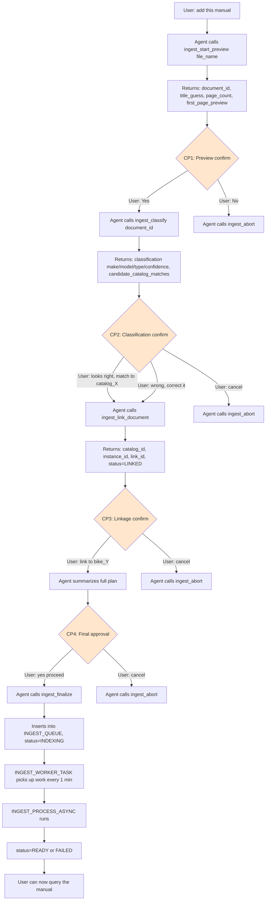

# Document Ingestion Pipeline

The ingestion pipeline is a human-in-the-loop (HITL) flow with 4 explicit checkpoints. The
Sprocket agent orchestrates the flow by calling stored procedures and presenting each
checkpoint's results to the user for confirmation.

## Design philosophy

- **Conversational:** The user says "add this manual" — the agent drives the flow
- **HITL at decision points:** Confirm preview, classification, linkage, finalization
- **Procedural for mechanics:** Parsing, chunking, extracting are deterministic SQL/Python
- **LLM where judgment is needed:** AI_COMPLETE classifies make/model/document_type
- **Async for slow work:** Image descriptions run in background so the user isn't blocked
- **Idempotent:** Retrying a procedure at the same status doesn't corrupt state

## State machine

`DOCUMENT_REGISTRY.status` tracks progress:

```
UPLOADED  →  PARSED  →  CLASSIFIED  →  LINKED  →  INDEXING  →  READY
                                                            ↘  FAILED
                                ↘  ABORTED (user cancels at any checkpoint)
```

## The 4 checkpoints



## Procedure reference

All procedures in `SPROCKET.PIPELINE` schema.

### INGEST_START

**Signature:** `INGEST_START(file_name VARCHAR) RETURNS VARIANT`

**Purpose:** Registers a file from `@SPROCKET.RAW.MANUALS_STAGE` and parses the first 3 pages
for preview. Does NOT process images or index the full document yet.

**State transition:** `(none) → UPLOADED → PARSED`

**Returns:**
```json
{
  "document_id": "uuid",
  "status": "PARSED",
  "resumed": false,
  "title_guess": "extracted from first page heading",
  "source_file": "filename.pdf",
  "page_count": 187,
  "first_page_preview": "first 400 chars of page 1 content"
}
```

**Idempotency:** If called twice on the same `file_name`, returns the existing
`document_id` with `resumed: true` rather than creating a duplicate registration.

**Checkpoint:** CP1 — Agent presents the preview and asks "Is this the correct document?"

---

### INGEST_CLASSIFY

**Signature:** `INGEST_CLASSIFY(document_id VARCHAR) RETURNS VARIANT`

**Purpose:** Sends the first 3 parsed pages (up to 9,000 chars) to `AI_COMPLETE('claude-4-sonnet', ...)`
with a structured classification prompt. Returns make, model, component_type, document_type,
link_type, and a confidence score (0.0–1.0). Also searches the existing `COMPONENT_CATALOG`
for fuzzy matches on make + model.

**State transition:** `PARSED → CLASSIFIED`

**Returns:**
```json
{
  "document_id": "uuid",
  "status": "CLASSIFIED",
  "classification": {
    "make": "Hayes",
    "model": "Dominion A4",
    "model_year": null,
    "component_type": "Hydraulic Disc Brake",
    "component_category": "Brakes",
    "document_type": "brake_install_guide",
    "link_type": "install_guide",
    "confidence": 0.95,
    "reasoning": "Title and first pages explicitly describe Hayes Dominion A4 installation and setup"
  },
  "proposed_catalog_id": "brake-hayes-dominion",
  "candidate_matches": [
    {"catalog_id": "brake-hayes-dominion", "make": "Hayes", "model": "Dominion", ...}
  ]
}
```

**Checkpoint:** CP2 — Agent presents the classification and asks:
- "Does this look right?"
- "Should I match to an existing catalog entry, or create a new one?"
- If `confidence < 0.7`, agent explicitly flags uncertainty

---

### INGEST_LINK

**Signature:** `INGEST_LINK(document_id VARCHAR, catalog_id VARCHAR, bike_id VARCHAR, link_type VARCHAR) RETURNS VARIANT`

**Purpose:** Creates or reuses a `COMPONENT_CATALOG` entry, creates a `BIKE_COMPONENT_INSTANCES`
row (if `bike_id` is provided), and creates the `COMPONENT_DOCUMENT_LINK`.

**State transition:** `CLASSIFIED → LINKED`

**Parameters:**
- `catalog_id` — Pass an existing catalog UUID to reuse, or `NULL` to create a new entry from
  the classification
- `bike_id` — Bike to link the component to, or `NULL` for component-only (no bike association)
- `link_type` — e.g., `"service_manual"`, `"install_guide"`, `"bleed_guide"`. `NULL` defaults to
  the classification's suggested `link_type`.

**Returns:**
```json
{
  "document_id": "uuid",
  "status": "LINKED",
  "catalog_id": "brake-hayes-dominion",
  "instance_id": "uuid or null",
  "link_id": "uuid",
  "link_type": "install_guide"
}
```

**Idempotency:** If the catalog entry, instance, or link already exists, the procedure reuses
them rather than creating duplicates.

**Checkpoint:** CP3 — Agent presents the linkage plan (which catalog entry, which bike, which
link_type) and asks for confirmation. User can correct any of the three values.

---

### INGEST_FINALIZE

**Signature:** `INGEST_FINALIZE(document_id VARCHAR) RETURNS VARIANT`

**Purpose:** Validates status is `LINKED` or `CLASSIFIED`, updates status to `INDEXING`,
and enqueues the document for async processing by inserting a row into `PIPELINE.INGEST_QUEUE`.
Does NOT block — returns immediately.

**State transition:** `LINKED → INDEXING`

**Returns:**
```json
{
  "document_id": "uuid",
  "status": "INDEXING",
  "message": "Document queued for processing. Typical time: 1 minute per 10 pages (image description is the slow step).",
  "estimated_minutes": 19
}
```

**Checkpoint:** CP4 — Agent summarizes the complete plan (classification + linkage + processing
time) and asks "Ready to proceed?" Only on explicit user "yes" does the agent call this procedure.

---

### INGEST_PROCESS_ASYNC

**Signature:** `INGEST_PROCESS_ASYNC(document_id VARCHAR) RETURNS VARIANT`

**Purpose:** The heavy-lifting procedure that processes the document fully:
1. Parse all remaining pages (not just the first 3)
2. Update preview pages to add `images` field (first parse skipped extract_images)
3. Extract images from `DOCUMENT_PAGES.images` → `DOCUMENT_IMAGES` table
4. Save base64 images to `@SPROCKET.RAW.IMAGES_STAGE` as files
5. Generate descriptions for all images using `AI_COMPLETE('pixtral-large', ...)`
6. Insert text chunks into `SEARCH.DOCUMENT_CHUNKS`
7. Insert image description chunks into `SEARCH.DOCUMENT_CHUNKS`

**State transition:** `INDEXING → READY` or `INDEXING → FAILED` on error

**Invoked by:** `PIPELINE.INGEST_WORKER_TASK` (runs every 1 minute, picks oldest enqueued doc)

**Progress tracking:** Updates `DOCUMENT_REGISTRY.progress_pct` at checkpoints: 50 (start) →
60 (pages parsed) → 70 (images extracted) → 75 (images saved) → 90 (descriptions complete) →
100 (chunks inserted).

**Returns:**
```json
{
  "document_id": "uuid",
  "status": "READY",
  "chunks_inserted": 74,
  "images_processed": 25
}
```

**Error handling:** On exception, status → `FAILED` and `error_message` is populated with the
SQL error text (truncated to 1000 chars).

**Idempotency:** Inserts check `NOT EXISTS` before inserting chunks, so retrying a failed run
won't create duplicates.

---

### INGEST_ABORT

**Signature:** `INGEST_ABORT(document_id VARCHAR, reason VARCHAR) RETURNS VARIANT`

**Purpose:** Cancels an in-progress ingestion and cleans up partial state:
- Deletes from `INGEST_QUEUE` (if enqueued)
- Deletes from `DOCUMENT_CHUNKS` (if any chunks were inserted)
- Deletes from `DOCUMENT_IMAGES` (if extracted)
- Deletes from `DOCUMENT_PAGES` (parsed pages)
- Deletes from `COMPONENT_DOCUMENT_LINK` (if linked)
- Updates `DOCUMENT_REGISTRY.status` to `ABORTED`

**State transition:** `(any) → ABORTED`

**Called when:** User says "no" or "cancel" at any checkpoint, or the agent encounters an
unrecoverable error.

---

### INGEST_STATUS

**Signature:** `INGEST_STATUS(document_id VARCHAR) RETURNS VARIANT`

**Purpose:** Polls the current state of a document.

**Returns:**
```json
{
  "document_id": "uuid",
  "source_file": "filename.pdf",
  "status": "INDEXING",
  "progress_pct": 75,
  "status_updated_at": "2026-04-28T16:45:00.000Z",
  "page_count": 187,
  "classification": {...},
  "proposed_catalog_id": "fork-rockshox-lyrik-2023",
  "error_message": null
}
```

**Used by:** Agent when user asks "is my document ready yet?" or after finalize to periodically
check async progress.

---

## Worker Task

**Task:** `SPROCKET.PIPELINE.INGEST_WORKER_TASK`  
**Schedule:** Every 1 minute  
**Warehouse:** `SPROCKET_WH` (MEDIUM)  
**Status:** ACTIVE (resumed)

**Logic:**
1. Query `INGEST_QUEUE` for oldest row where `picked_up_at IS NULL`
2. If found: mark `picked_up_at = now()` and call `INGEST_PROCESS_ASYNC(document_id)`
3. If none found: exit immediately (no warehouse usage)

The task runs continuously in the background. Documents enqueued via `INGEST_FINALIZE` are
processed within ~1 minute of enqueue time.

---

## Why async?

Image description is the bottleneck: `AI_COMPLETE('pixtral-large', ...)` takes ~1-3 seconds
per image. A 147-page Vivid manual with 50 images = ~100 seconds just for descriptions.
Parsing and chunking are comparatively fast (~10-30 seconds total even for 200 pages).

By queueing the work, the agent conversation doesn't hang for 15-20 minutes while pixtral-large
grinds through images. The user gets a "processing in background, I'll let you know when ready"
message and can continue using the agent for other questions.
